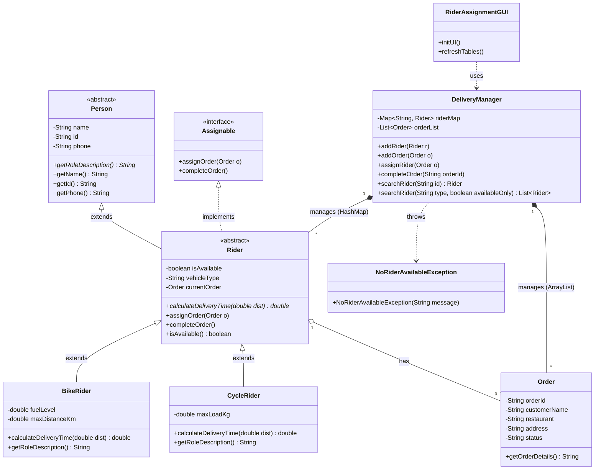


# 🚴‍♂️ Smart Food Delivery Rider Assignment & Dispatch System

[](https://www.oracle.com/java/)
[](https://docs.oracle.com/javase/tutorial/uiswing/)
[](#-core-oop-principles-applied)
[](https://puc.ac.bd/)

An OOP-driven desktop dispatch management system built with **Java** and **Java Swing**. This project simulates an automated real-time dispatch dashboard for food delivery platforms, intelligently matching incoming orders with the most suitable delivery partners (motorbikes vs. eco-friendly bicycles) based on trip distances, vehicle capacities, and real-time availability.

Developed as a term project for **CSE 1116: Object Oriented Programming Laboratory**, Department of Computer Science & Engineering, **Premier University, Chattogram**.

---

## 📌 Problem Statement & Motivation

Manual dispatch systems frequently encounter:

1. **Inefficient Dispatching:** Manual allocation leads to human error and delays.
2. **Vehicle Mismatch:** Assigning motorbikes to short trips wastes fuel, while assigning bicycles to long trips causes late deliveries.
3. **Peak-Hour Bottlenecks:** System crashes or duplicate assignments during peak hours when all riders are occupied.

### 💡 Our Solution

An intelligent dispatcher with:

- **Distance-aware Smart Routing:** Green/eco-friendly bicycle assignment for short trips ($\le 5\text{ km}$) and motorbikes for longer trips.
- **Robust Exception Handling:** Implements a custom checked `NoRiderAvailableException` to prevent duplicate assignments and crashes when fleet capacity is maxed out.
- **Live Interactive Dashboard:** A responsive Swing GUI backed by high-performance Java Collections.

---

## 🚀 Key Features

* **FR1: Dynamic Rider Registration:** Register Motorbike (`BikeRider`) and Bicycle (`CycleRider`) partners with vehicle-specific metrics (fuel level, max load capacity, range).
* **FR2: Real-time Fleet Status Board:** Live monitoring of all delivery partners (`Available` vs `On Delivery`).
* **FR3: Order Generation:** Place delivery orders specifying customer, restaurant, delivery address, and distance.
* **FR4: Automated Smart Dispatch:** Automatically matches orders based on distance thresholds or manual vehicle preferences; calculates precise estimated delivery times.
* **FR5: One-Click Delivery & Rider Release:** Mark orders as completed, instantly freeing up the rider back to `Available` status.
* **FR6: Active & Historical Logs:** Structured order tracking from `Pending` $\rightarrow$ `Assigned` $\rightarrow$ `Delivered`.

---

## 🧠 Core OOP Principles Applied

| OOP Concept             | Implementation Details                                                                                                                                                                                                                                                |
| :---------------------- | :-------------------------------------------------------------------------------------------------------------------------------------------------------------------------------------------------------------------------------------------------------------------- |
| **Encapsulation** | All entity fields (`name`, `id`, `fuelLevel`, `maxLoadKg`, `status`) are strictly `private`. State mutation is restricted to getters, setters, and state-transition methods. Internal collections inside `DeliveryManager` are completely encapsulated. |
| **Inheritance**   | A robust**3-level hierarchy**: `Person` (abstract base) $\rightarrow$ `Rider` (abstract delivery agent) $\rightarrow$ `BikeRider` / `CycleRider` (concrete vehicle implementations).                                                                |
| **Polymorphism**  | •**Runtime Overriding:** `calculateDeliveryTime(double dist)` dynamically calculates transit times (Motorbike: ~30 km/h, Bicycle: ~12 km/h).• **Compile-time Overloading:** `searchRider(String id)` vs `searchRider(String vehicleType)`.        |
| **Abstraction**   | •`Person` defines abstract identity contracts (`getRoleDescription()`).• `Assignable` interface decouples order assignment mechanics (`assignOrder()`, `completeOrder()`) from specific vehicle implementations.                                          |

---

## 🏗️ System Architecture & UML Diagram



---

## ⚙️ Smart Dispatch Logic

```text
                     [ Incoming Order ]
                             │
                  Is distance <= 5 km?
                     /               \
                   YES                NO
                   /                    \
       [ Try CycleRider First ]   [ Assign BikeRider ]
           (Eco-Friendly)           (Speed: 30 km/h)
                 │
       Is Cycle Available?
             /        \
           YES         NO
           /             \
    [ Assign Cycle ]   [ Fallback to BikeRider ]
   (Speed: 12 km/h)
                 │
                 ▼
        Is Rider Available?
             /        \
           YES         NO
           /             \
 [ Order Assigned ]   [ Throw NoRiderAvailableException ]
                      [ Show UI Alert Dialog            ]
```

---

## 🛠️ Data Structures & Complexity

* **`HashMap<String, Rider>`:** Provides $\mathcal{O}(1)$ average-time complexity for looking up riders by unique ID and updating delivery states during high-volume operations.
* **`ArrayList<Order>`:** Maintains a chronological queue and audit trail for order processing (`Pending` $\rightarrow$ `Assigned` $\rightarrow$ `Delivered`).

---

## 💻 Tech Stack

* **Language:** Java (JDK 17 or higher recommended)
* **GUI Toolkit:** Java Swing & AWT (`JFrame`, `JTable`, `DefaultTableModel`, `JOptionPane`)
* **Design Patterns:** Model-View-Controller (MVC) separation concept, Interface-driven design

---

## 📂 Project Structure

```text
├── src/
│   ├── model/
│   │   ├── Person.java
│   │   ├── Assignable.java
│   │   ├── Rider.java
│   │   ├── BikeRider.java
│   │   ├── CycleRider.java
│   │   └── Order.java
│   ├── manager/
│   │   └── DeliveryManager.java
│   ├── exception/
│   │   └── NoRiderAvailableException.java
│   └── gui/
│       └── RiderAssignmentGUI.java
│   └── Main.java
├── screenshots/
│   ├── dashboard.png
│   └── order_dispatch_modal.png
└── README.md
```

---

## ⚡ Getting Started

### Prerequisites

* Java Development Kit (JDK 11 or higher) installed.
* Git installed on your system.

### Installation & Execution

1. **Clone the repository:**

   ```bash
   git clone https://github.com/prantamohajan/food-delivery-rider-system.git
   cd food-delivery-rider-system
   ```
2. **Compile the source files:**

   ```bash
   javac -d bin src/**/*.java
   ```
3. **Run the application:**

   ```bash
   java -cp bin Main
   # or run RiderAssignmentGUI directly:
   # java -cp bin gui.RiderAssignmentGUI
   ```

*(Alternatively, open the project directly inside IntelliJ IDEA, Eclipse, or NetBeans and run `Main.java` or `RiderAssignmentGUI.java`)*.

---

## 👥 Project Contributors

| Name                     |      Student ID      |           Department           |          Institution          |
| :----------------------- | :------------------: | :----------------------------: | :----------------------------: |
| **Pranta Mohajan** | `0222510005101025` | Computer Science & Engineering | Premier University, Chattogram |
| **Shreya Sen**     | `0222510005101029` | Computer Science & Engineering | Premier University, Chattogram |
| **Arpita Paul**    | `0222510005101033` | Computer Science & Engineering | Premier University, Chattogram |

---

## 📜 Academic Note & License

This project was developed strictly for academic purposes as part of the **CSE 1116: Object Oriented Programming Laboratory** curriculum (Session 2026). Open source under the [MIT License](LICENSE).
